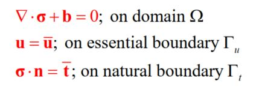

## RKPM-PDE and elasticity

A RMPM code developed for solving PDEs. Here the elasticity is solved using four approaches:
1. Transformation method
2. Lagrangian multiplier
3. Penalty method
4. Nitsche's method

## Content
- source: the source code including:
  - preprocessing: discretization, gaussian points generation
  - processing: form system matrix and solve the linear algebra equations (the displacement)
  - postprocessing: solve strain/stress
- run_cases: sample applications 

## How to cite
Chen, Guang. "MESHFREE VISCOELASTIC MODELING: TOWARD NUMERICAL SIMULATION OF PRINTING CONCRETE STRUCTURES." (2019).
